# 视频号刷到的好素材，怎么存成 MP4？做了个工具，过程记录一下

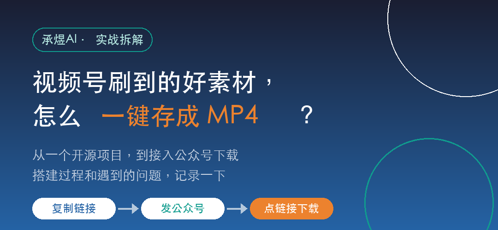

> 说明一下：这个工具只用来下载自己的、或者已经获得授权的公开普通视频，不用于抓取私密、付费、直播或有版权的内容。

## 一、为什么做这个

视频号里刷到一条想留存的素材，没法直接保存到本地，视频号没有这个按钮。

电脑上有一些开源方案能解析下载，但我要的是手机上能用，尤其是 iPhone。想要的效果很简单：复制链接发出去，回一个下载地址，点一下视频就存进手机，不用装 App。

做出来之后，接在了我自己的公众号「承煜AI」上。这篇把搭建过程和中间遇到的问题记录一下，给想动手做类似小工具的人参考。

## 二、用户怎么用

最终的使用方式是三步：

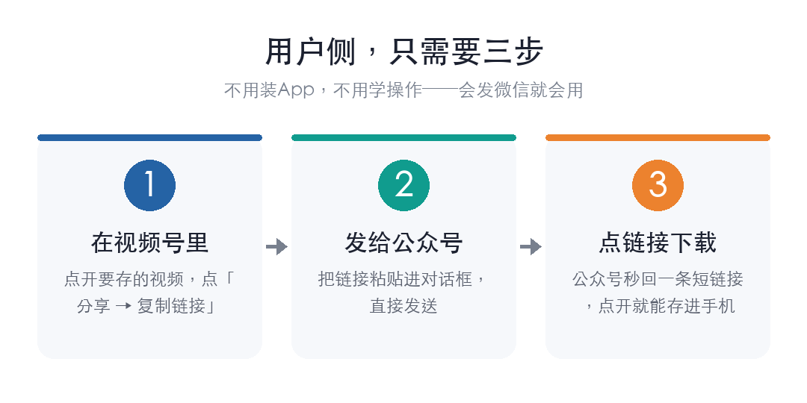

1. 在视频号里点开视频，点「分享 → 复制链接」；
2. 把链接发给公众号；
3. 公众号回一条下载链接，点开存进手机。

下载地址形如 `https://saveclip.cn/d/xxxxxxxx`，链接 10 分钟后失效。文件名是 `作者_视频标题.mp4`。存进 iPhone 的「文件」App 文件名会保留；存进「照片」App，iOS 一般不显示原始文件名。

## 三、入口怎么选

参考的是 GitHub 上的开源项目 `ltaoo/wx_channels_download`，它解决的是电脑端下载。要搬到手机上，先得定用户从哪个入口进来。我比较了四种：

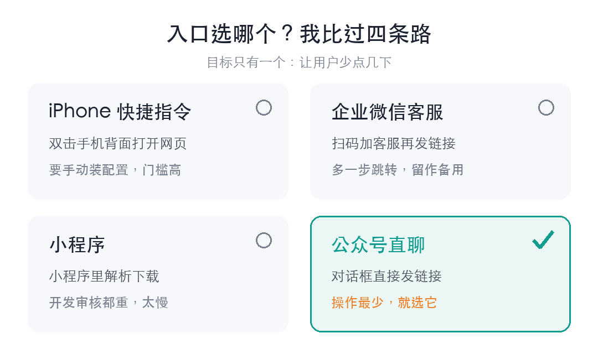

- **iPhone 快捷指令**：双击手机背面打开网页，但用户要自己装配置，门槛高；
- **企业微信客服**：扫码加客服再发链接，多一步跳转；
- **小程序**：开发和审核都重，慢；
- **公众号直聊**：对话框里直接发链接。

最后选了公众号直聊做主入口，企业微信客服留作备用。原因是公众号直聊用户的操作步数最少，不跳转、不加好友，发条消息就行。

## 四、需要哪些东西

把它拆成几个部分：

**服务器**：租一台云服务器，程序跑在上面，接收用户发来的链接。用的是普通 Ubuntu 机器，配置不用高。

**域名 + HTTPS**：注册了域名 `saveclip.cn`，配了免费的 HTTPS 证书。微信只接受 HTTPS，这是硬性要求。配好后访问 `https://saveclip.cn/health` 返回 `{"ok":true}` 就说明通了。

**手机端下载页**：粘贴链接、勾选确认素材来源、解析出标题作者和视频地址、预览、下载。微信内置浏览器或 Safari 下载受限时，还有个「直接打开视频」的兜底。

**命名规则**：文件统一命名 `作者_标题.mp4`，自动去掉文件名里不能用的字符，太长截断到 150 字以内，标题为空时叫「视频号素材.mp4」。

## 五、完整流程

把这些串起来，一条消息从发出到拿到下载链接，流程是这样：

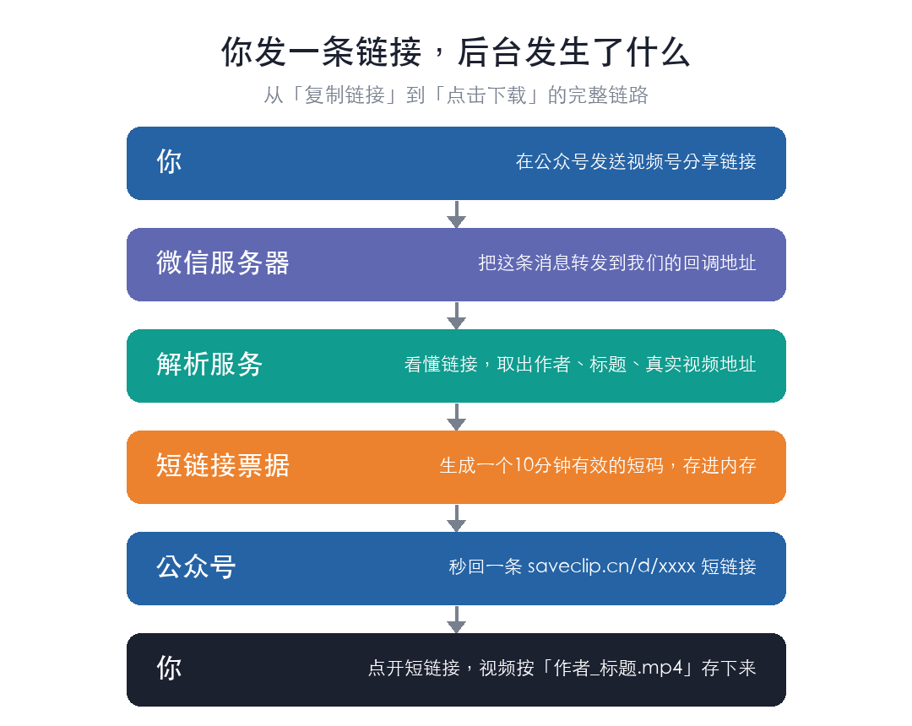

中间两步是关键：解析负责看懂视频号链接，取出作者、标题和真实视频地址；短链接负责把结果递给用户。短链接这一步是踩了坑之后才加上的。

## 六、遇到的问题：链接显示「已过期」

第一次打通公众号后，发链接进去能正常回复下载地址，但点开就显示「下载链接已过期」。设的是 10 分钟有效，实际间隔只有几秒。

排查后发现，是链接太长导致的：

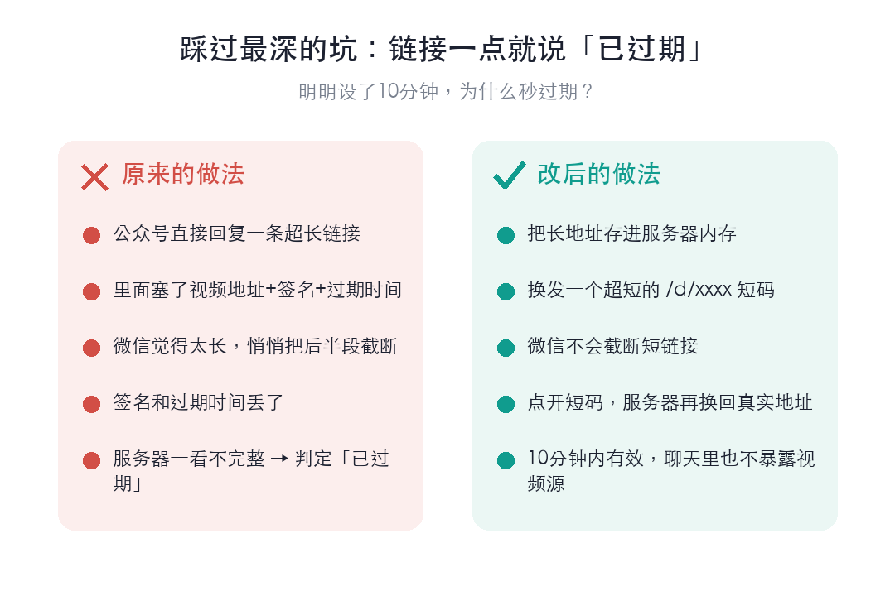

原来的做法是公众号直接回复完整下载地址，里面包含视频真实地址、签名、过期时间等参数，整条链接很长。微信处理这种超长链接时会把后半段截断，签名和过期时间丢失，服务器收到不完整的链接就判定为无效。

解决办法是改用短链接：把真实的长地址存进服务器内存，对外只回 `saveclip.cn/d/xxxx` 这样的短码，微信不会截断它；用户点开短码，服务器再换回真实地址下载。改完之后过期的问题就没有了，另外聊天窗口里也不会暴露视频的真实源地址。

短码目前存在单机内存里，服务重启后已发出的短链接会失效。自用够了，要正式对外得换成 Redis。

## 七、公众号接入

微信现在把公众号后台迁到了「微信开发者平台」，在 **基础信息 → 域名与消息推送配置** 里启用消息推送，填好回调地址、Token 和密钥，加解密方式选明文模式。

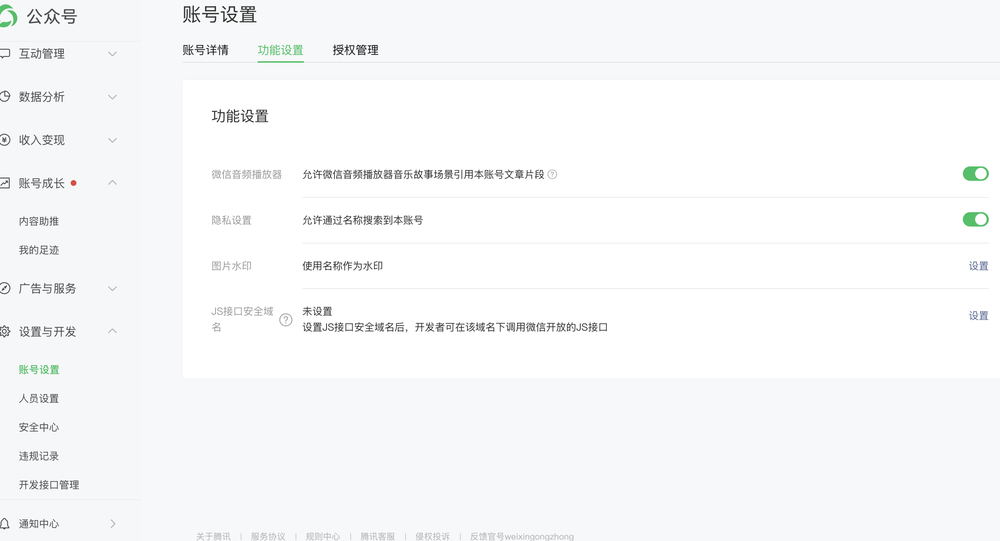

接入后的逻辑：用户给公众号发消息，微信把消息推到回调地址，程序校验来源、读出文本、提取分享链接、调用解析、生成短码，然后在 5 秒内把短链接回过去。微信对被动回复有 5 秒限制，解析速度要够快。

## 八、备用入口：企业微信客服

主入口是公众号，企业微信客服这条线也跑通了留作备用，配置步骤更多一些：建自建应用 → 配权限 → 设可信 IP → 接管客服账号 → 生成客服链接。这里有几张后台截图。

自建应用接管客服账号、配置各项能力：

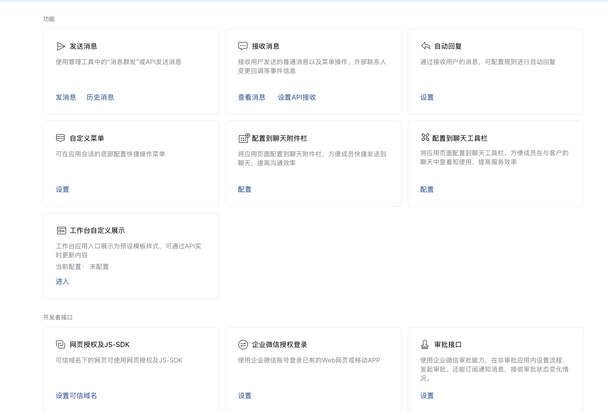

给应用配权限，能创建和管理客服账号：

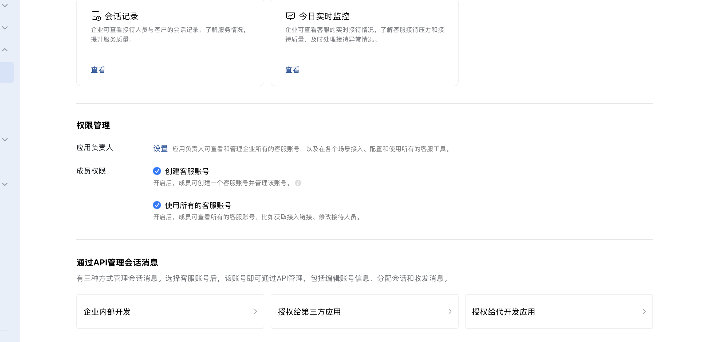

把应用设为可调用接口的应用时，要配置可信 IP，就是把服务器公网 IP 加进白名单。没配会有提示：

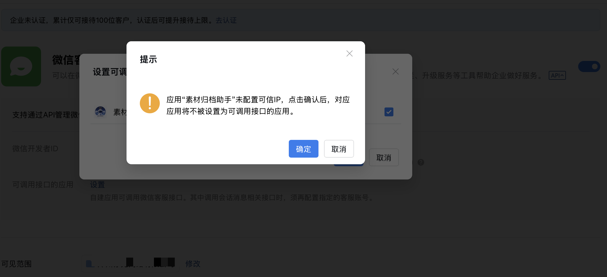

配好后，客服账号详情页能看到接入链接、生成二维码、配置接待人员（下图公司信息已打码）：

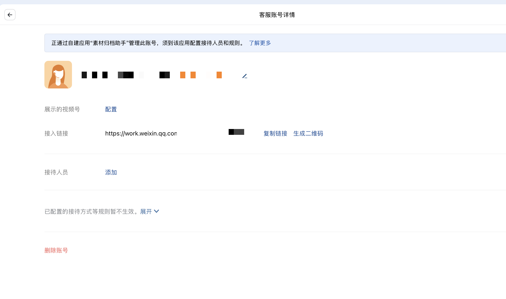

客服支持在视频号小店、公众号、小程序、网页等多个场景接入：

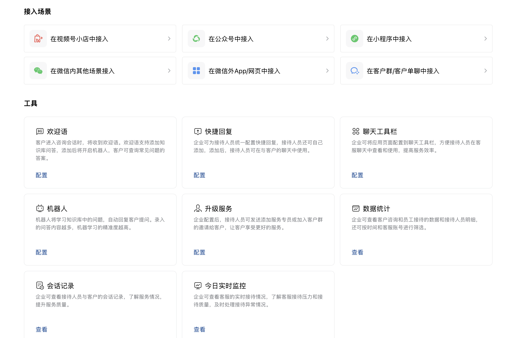

生成的客服二维码，用户扫码进来发链接：

客服号名字改成了「创作者素材归档助手」。这条线是备用，主力还是公众号直聊。

## 九、现在的进度和边界

这套东西现在是自用加学习交流的版本，流程跑通了，但离正式对外运营还有距离：

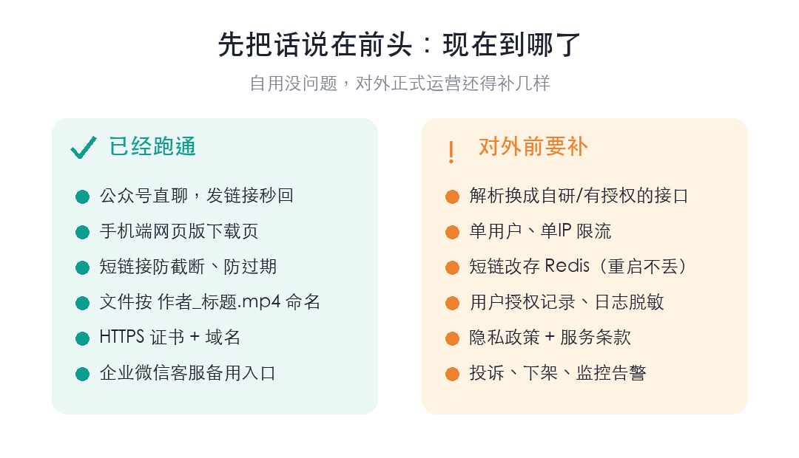

左边是已经跑通的，右边是对外之前需要补的。解析这块要换成自研的或者有商业授权的接口，另外还要加限流、Redis、用户授权记录、日志脱敏、隐私政策和服务条款、投诉下架机制、监控告警。

骨架是现成的：下载页、公众号回调、短链接、命名、HTTPS 这些都能留，需要替换的主要是中间的解析层。

工具现在挂在公众号「承煜AI」上自用。如果想了解自己的生意能怎么用 AI 落地，可以来找我聊。
